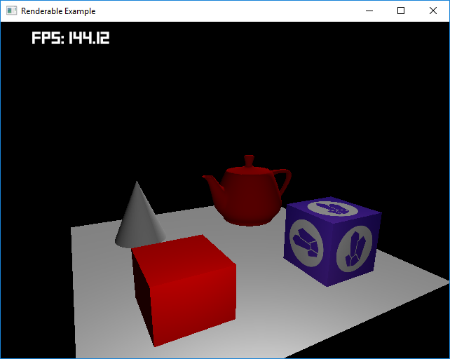
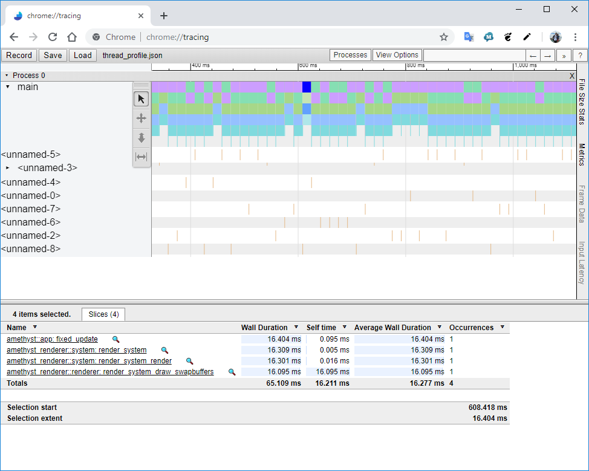
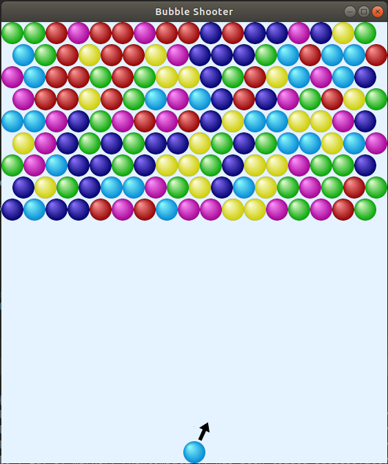

## Amethyst: Game Engine Engine

Azriel Hoh

---

### Agenda

* History
* Philosophy
* Features
* Experience / Feedback
* Show off

---

### History

+++

### History

```bash
$ git log --oneline --graph
```


+++

### History

* Originally authored in 2016 by Eyal Kalderon.
* Based on the Bitsquid / Stingray engine (discontinued).
* Original post: https://nullpwd.wordpress.com/2016/01/13/starting-an-open-source-project/
* Now, a 501(c)(3) non-profit organization with 24 members.

---

### Philosophy

+++

### Philosophy

- **Unix Philosophy:** Highly composable, modular components.
- **Entity Component System (ECS) model:** Partition data by behaviour, as opposed to object state.
- **Multi-threading:** Drives design to support parallel processing of data.

---

### Philosophy: Unix Philosophy

+++

### Philosophy: Unix Philosophy

> do one thing and do it well
>
> &ndash; Peter H. Salus

+++

### Philosophy: Unix Philosophy

> Unity or Godot are relatively good at what they do, but tend to bend the designer in a specific direction.

@size[0.6em](`@webshinra` https://community.amethyst-engine.org/t/a-little-feedback/418)

+++

### Philosophy: Unix Philosophy

> Amethyst does not force you to adopt the way the creator thinks you should build a game, but it means that you have to be a good programmer to architect a game.
>
> It's also the kind of stuff which badly done, would cause massive refactoring later

@size[0.6em](`@webshinra` https://community.amethyst-engine.org/t/a-little-feedback/418)

+++

### Philosophy: Unix Philosophy

TODO: diagram for game engines usually creating a mould, with bits that you can plug in.

+++

### Philosophy: Unix Philosophy

TODO: diagram for amethyst with many blocks, but you have to join them together

---

### Philosophy: ECS Model

+++

### Philosophy: ECS Model

TODO: Diagram for Player and Monster class

+++

### Philosophy: ECS Model

TODO: Diagram for object instances

+++

### Philosophy: ECS Model

TODO: Diagram for component storages

---

### Features

---

### Features: Rendering

+++

### Features: Rendering

Currently OpenGL via `gfx`.

This will be replaced with `rendy`, backed by `gfx-hal`.


+++

### Features: Rendering 2D


+++

### Features: Rendering 3D



---

### Features: Asset Loading

+++

### Features: Asset Loading

**Asset:** Configuration / data loaded at runtime.

* Audio files
* Textures (aka images)
* Scripts

+++

### Features: Asset Loading

TODO: diagram "isn't is just `file.read()?.parse()?`"

+++

### Features: Asset Loading

* Asynchronous
* Potential for caching
* Hot-reload

+++

### Features: Asset Loading

Demo: Hot Reload

@size[0.6em](see also: [`warmy`](https://crates.io/crates/warmy))

---

### Features: Networking

+++

### Features: Networking

**Laminar:** Protocol built over UDP, with some TCP features.

**Repository:** https://github.com/amethyst/laminar

@size[0.3em](The code is *pristine*)

+++

### Features: Networking

Demo: `net_client` and `net_server`

<!-- unset AMETHYST_LOG_LEVEL_FILTER -->

```bash
./target/debug/examples/net_server
./target/debug/examples/net_client
```

---

### Features: UI

+++

### Features: UI

Very much a work in progress.


---

### Features: Thread Profiler

+++

### Features: Thread Profiler

Uses the [`thread_profiler`](https://crates.io/crates/thread_profiler) crate to track time spent within functions.

```rust
// Sprinkle this everywhere
#[cfg(feature = "profiler")]
profile_scope!("transform_system");
```

+++

### Features: Thread Profiler

Open `thread_profile.json` at `chrome://tracing`:



---

### Features: Test Automation

+++

### Features: Test Automation

```rust
#[test]
fn my_system_does_something() -> Result<(), Error> {
    AmethystApplication::blank()
        .with_system(MySystem, "my_system", &[])
        .with_setup(|world| {
            // ..
        })
        .with_assertion(|world| {
            // ..
        })
        .run()
}
```

---

### Features: Other

+++

### Features: Other

* **Audio:** Play a sound.
* **Animation:** Interpolated component data mutations over time.
* **Editor:** Proof-of-concept ([repo](https://github.com/amethyst/amethyst-editor)).
* **Prefabs:** *Premade fabrication* &ndash; templates for components.
* **Physics:** To be implemented.
* **WASM:** To be implemented.

---

### Personal Experience

+++

### Personal Experience

* Expect API instability.
* Expect to read source.
* Expect to change source.

---

### Show Off

+++

### Show Off



+++

### Show Off


+++

### Show Off


+++

### Show Off

<video autoplay loop width="504" height="303" controls>
  <source src="assets/images/show_off_platform.mp4" type="video/mp4">
  Your browser does not support the video tag.
</video>

+++

### Show Off

<video autoplay loop width="386" height="432" controls>
  <source src="assets/images/show_off_shooter.mp4" type="video/mp4">
  Your browser does not support the video tag.
</video>

+++

### Show Off

<video autoplay loop width="480" height="270" controls>
  <source src="assets/images/show_off_waves.mp4" type="video/mp4">
  Your browser does not support the video tag.
</video>

---

### Questions, Answers and Comments

---

### Thanks!

* Amethyst community

---

### Links

* @size[0.7em](Slides: https://github.com/azriel91/amethyst_engine_engine)
* @size[0.7em](Website: https://amethyst.rs)
* @size[0.7em](Book: https://amethyst.rs/book/latest)
* @size[0.7em](Repo: https://github.com/amethyst/amethyst)
* @size[0.7em](Discord: https://discord.gg/amethyst)
* @size[0.7em](Forum: https://community.amethyst-engine.org)
* @size[0.7em](https://arewegameyet.com)
* Also see `ggez`, `crayon`, `tetra`, `gate`
